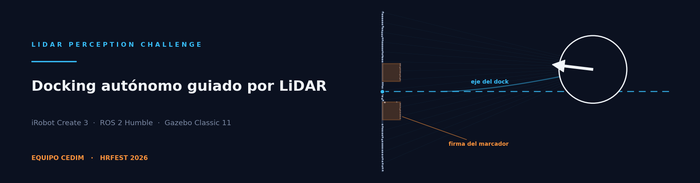

<p align="center">
  
</p>

<p align="center">
  
  
  
  
  
</p>

<h1 align="center">Docking autónomo guiado por LiDAR</h1>

<p align="center">
  Solución del <b>Equipo CEDIM</b> al <a href="https://hrfest.org/congress/2026/competitions"><b>LiDAR Perception Challenge</b></a>
  de HRFEST 2026.<br>
  Llevar un <b>iRobot Create 3</b> hasta su estación de carga desde cualquier punto de la sala
  <b>usando únicamente el LiDAR</b>.<br>
  Sin la acción <code>/dock</code>, sin infrarrojos, sin ground truth y sin una sola coordenada escrita a mano.
</p>

---

## El problema

El dock es invisible para el LiDAR. Lo único que el sensor puede ver son **dos cajas de 8 × 8 cm**
montadas en la pared que hay detrás, separadas por un hueco de 9.5 cm. De esa firma —dos escalones
que sobresalen 8 cm sobre el plano de la pared— hay que deducir dónde está el dock y acoplarse.

El margen no es generoso:

| Condición de acoplamiento | Umbral |
|---|---|
| Distancia receptor–emisor | < 7.5 cm |
| Robot sobre el eje del dock | ± 6° |
| Orientación del robot | ± 6° |

A la distancia de acoplamiento, esos **± 6° son menos de 8 mm de desvío lateral**.

## Arranque rápido

```bash
# Terminal 1 — el escenario oficial del reto, sin modificar
ros2 launch create3_dock_challenge challenge_world.launch.py

# Terminal 2 — nuestra solución: un único comando
ros2 launch cedim_dock solution.launch.py
```

## Instalación

Requiere **Ubuntu 22.04**, **ROS 2 Humble** y **Gazebo Classic 11**.

```bash
# 1. ROS 2 Humble y herramientas de compilación
sudo apt update
sudo apt install -y ros-humble-desktop python3-colcon-common-extensions python3-rosdep
sudo rosdep init 2>/dev/null; rosdep update

# 2. Espacio de trabajo con el escenario del reto y nuestra solución
mkdir -p ~/sim_ws/src && cd ~/sim_ws/src
git clone https://github.com/Kalman-Robotics/create3_dock_challenge.git
git clone https://github.com/JoseSegundoM/hrfest2026-lidar-dock-cedim.git cedim_dock

# 3. Dependencias (Gazebo Classic, paquetes del Create 3, xacro…)
cd ~/sim_ws
source /opt/ros/humble/setup.bash
rosdep install --from-paths src --ignore-src -r -y

# 4. Compilar
colcon build --symlink-install
source install/setup.bash
```

> Si `rosdep` deja Gazebo a medias, complétalo con:
> ```bash
> sudo apt install -y gazebo ros-humble-gazebo-ros-pkgs \
>   ros-humble-irobot-create-gazebo-bringup ros-humble-irobot-create-gazebo-plugins
> ```

## Cómo funciona

```
/scan ──▶ perception.py ──▶ estimator.py ──▶ control.py ──▶ /cmd_vel
          ajuste de pared    dock como        punto de espera
          + cara frontal     landmark en      sobre el eje,
          de las cajas       odom (Kalman)    luego entrada recta
```

Tres decisiones sostienen el resto.

### 1. La orientación sale de la pared, no de las cajas

Las cajas dan dos o tres ecos cada una a distancia media; la pared da varios cientos. Ajustar
primero el plano de la pared por mínimos cuadrados totales y trabajar después en ese marco deja el
error angular en **centésimas de grado**, frente al margen de ± 6°. Las cajas solo se usan para
fijar el centro lateral.

### 2. Solo cuentan los ecos de la cara frontal de cada caja

Vista de frente, una caja devuelve una cara. Vista en oblicuo devuelve también su **cara lateral**,
cuyos ecos caen sobre el borde exterior y están a menor profundidad. Promediarlos junto con los de
la cara frontal desplaza el centro estimado hacia fuera, y el desplazamiento crece con el ángulo de
visión: medido en banco, **hasta 2 cm**, más del doble del margen de 8 mm. Quedarse con la cara
frontal lo elimina.

### 3. El dock se estima como landmark estático en `odom`

Es la decisión que sostiene la precisión final. El estado del filtro no es una detección
instantánea sino la **pose del dock en el marco `odom`**, donde por definición no se mueve; cada
barrido aporta una medida y el filtro acumula evidencia con una covarianza anisótropa (la distancia
a la pared es precisa, el centrado lateral se degrada con la distancia).

Importa porque **los últimos centímetros son ciegos**: en la pose de acoplamiento el robot queda a
~0.27 m de la pared y el LiDAR va 5 cm por detrás de su centro, de modo que las cajas caen contra
el rango mínimo del sensor y la firma se degrada justo cuando más precisión hace falta. Con el dock
anclado en `odom`, el tramo final se ejecuta contra un estimado ya convergido y propagado por
odometría, no contra una medida que se está perdiendo.

### La maniobra

Un único regulador que llevara al robot desde cualquier pose hasta el dock acoplaría el error
lateral con el angular: llegaría girando, y el último grado de giro se traduce en milímetros de
desvío justo donde el margen es de 8 mm. Por eso la maniobra va en dos tramos:

| Estado | Qué hace |
|---|---|
| `SEARCH` | Gira sobre sí mismo hasta que el filtro converge sobre la firma del marcador. |
| `EXPLORE` | Si completa una vuelta entera sin encontrarla, avanza hacia el sector más despejado. La sala mide 6 × 4 m y el marcador solo es resoluble dentro de ~3.5 m: desde el fondo, girar más no sirve de nada. |
| `APPROACH` | Regulación polar hasta un **punto de espera sobre el eje del dock**, a 0.75 m y de frente, donde las tolerancias son holgadas. |
| `ENTER` | **Seguimiento de recta** sobre el eje: el error lateral se corrige a lo largo de todo el tramo y llega a cero antes del contacto. |
| `RECOVER` | Ante un contacto, retrocede y repite la aproximación. Una colisión cuesta 10 puntos. |

Las maniobras de escape —salir de un punto muerto en el punto de espera, explorar—
van **acotadas en el tiempo y en lazo abierto**. Es deliberado: una maniobra gobernada
por la propia distancia al objetivo realimenta la decisión que la disparó y el robot
acaba oscilando alrededor del umbral en vez de salir.

Si a mitad de la entrada el error lateral sigue fuera de margen, el nodo **aborta y repite** en vez
de acoplar mal: quedan 180 s por corrida y sobra tiempo para un segundo intento.

## Resultados

**Gazebo Classic 11, escenario oficial sin modificar.** El acoplamiento lo declara
`/dock_status.is_docked`, que es el criterio del reto: el plugin del simulador comprueba
los umbrales de 7.5 cm y ±6°.

| Pose inicial (x, y, yaw) | Distancia al dock | Resultado | Tiempo |
|---|---:|---|---:|
| `(0.4113, −0.1825, 20.6°)` — la de fábrica | 1.44 m | acoplado | 15.8 s |
| `(1.60, 0.30, 90.0°)` — pegado a la pared | 0.35 m | acoplado | 24.5 s |
| `(1.20, −0.80, 171.9°)` — de espaldas | 0.75 m | acoplado | 15.5 s |
| `(0.20, 0.90, −68.8°)` | 1.65 m | acoplado | 16.3 s |
| `(−0.80, −1.50, 85.9°)` | 2.75 m | acoplado | 18.8 s |
| `(−1.60, 1.10, 143.2°)` | 3.55 m | acoplado | 21.0 s |
| `(−2.80, −1.30, 11.5°)` | 4.75 m | acoplado (con exploración) | 34.2 s |
| `(−3.20, 1.50, −114.6°)` — esquina lejana | 5.15 m | acoplado (con exploración) | 46.3 s |

**Ocho corridas, ocho acoplamientos.** Son suficientes para comprobar que el lazo cierra en el
simulador real desde poses muy distintas —incluida una a 0.35 m de la pared, sin recorrido para
corregir, y otra en la esquina opuesta de la sala— pero no para dar una tasa de éxito.

La última se pasa 1.3 s del umbral de 45 s a partir del cual se empiezan a perder puntos de
tiempo. Desde la esquina más lejana el robot tiene que recorrer cinco metros antes de que el
marcador sea siquiera observable, y se ha preferido no acelerar la aproximación: el coste son
unas décimas del apartado de tiempo, y subir la velocidad pone en riesgo los otros 75 puntos.

**Banco de lazo cerrado a nivel ROS**, 72 poses aleatorias en la sala de 6 × 4 m repartidas en
dos conjuntos independientes. Replica el montaje real del LiDAR y traza los rayos contra la
geometría del escenario, pero integra la cinemática del robot sin modelar deslizamiento de
ruedas ni la rampa del dock:

| | Acopladas | Tiempo medio | Tiempo máx | Lateral máx | Angular máx | Colisiones |
|---|---|---:|---:|---:|---:|---:|
| Arranques a < 3.4 m | 36/36 | 14.1 s | 19.0 s | 5.49 mm | 0.73° | 0 |
| Arranques a ≥ 3.4 m | 36/36 | 31.3 s | 41.9 s | 4.95 mm | 0.60° | 0 |
| **Total** | **72/72** | 22.7 s | 41.9 s | 5.49 mm | 0.73° | **0** |

Ninguna corrida pasó de 45 s, que es el umbral por encima del cual se empiezan a perder puntos
de tiempo. Contra los márgenes de las bases —7.9 mm laterales y 6°— el peor caso deja un factor
de **1.44× en lateral** y de 8× en angular.

**El lateral es el que manda y no es holgado.** La mediana está en 3 mm y el percentil 90 en
5 mm, así que el reparto está lejos del umbral, pero un escenario que castigue la geometría más
que los probados es el sitio por donde esto fallaría. Es el riesgo residual conocido.

## Cumplimiento de las bases

| Interfaz | Uso |
|---|---|
| `/scan` | suscribe — **única** fuente de percepción del entorno |
| `/odom` | suscribe — propaga el estimado entre barridos |
| `/tf`, `/tf_static` | suscribe — montaje del sensor sobre el robot |
| `/dock_status` | suscribe — confirmación de acoplamiento |
| `/hazard_detection` | suscribe — contactos |
| `/cmd_vel` | publica — comando de velocidad |

**Verificado que NO se usan:** la acción `/dock`; `/ir_opcode` e `/ir_intensity`;
`/navigate_to_position`, `/drive_distance`, `/rotate_angle`, `/drive_arc`, `/wall_follow`;
ni ningún tópico o servicio de ground truth del simulador.

Del tópico `/hazard_detection` se atienden **solo** las clases de contacto físico
(`BUMP`, `STALL`, `WHEEL_DROP`). `OBJECT_PROXIMITY` se ignora a propósito: procede de los sensores
infrarrojos que las bases prohíben.

**Nada hardcodeado.** En el paquete no hay ninguna coordenada del mundo: ni la pose del dock, ni la
pose inicial, ni la posición de las paredes, ni una secuencia fija de movimientos. Las únicas
constantes geométricas están en [`cedim_dock/geometry.py`](cedim_dock/geometry.py) y son las
**medidas relativas del marcador** que las propias bases publican (8 × 8 cm de caja, 9.5 cm de
hueco, 17.5 cm entre centros). El montaje del LiDAR sobre el robot se lee de TF en tiempo de
ejecución, no se escribe a mano.

## Limitaciones conocidas

- **Alcance de la detección.** A 0.5° por haz, una caja de 8 cm deja de dar dos ecos más allá de
  unos 3.5 m —medido en banco, con caída brusca entre 3.5 y 4.5 m—. La sala del reto mide 6 × 4 m,
  así que desde el fondo el marcador sencillamente no es observable y el robot tiene que acercarse
  antes de poder verlo. De ahí el estado `EXPLORE`.
- **Dependencia de la odometría en el tramo final.** Los últimos ~0.2 m se recorren contra el
  estimado anclado en `odom`. Una deriva grande de odometría en ese tramo degradaría la precisión;
  el filtro la absorbe como ruido de proceso, pero no la observa.
- **Un solo marcador por escena.** El detector valida candidatos contra las cotas publicadas; dos
  pares de cajas con la misma separación en la misma sala confundirían al estimador.
- **Escenario estático.** No se modelan obstáculos móviles: ante un contacto el nodo retrocede y
  repite, pero no replanifica esquivando.

## Equipo

**CEDIM** · Centro de Desarrollo e Investigación en Mecatrónica · Lima, Perú

| Integrante | GitHub |
|---|---|
| José Luis Segundo Manayay | [@JoseSegundoM](https://github.com/JoseSegundoM) |
| Francisco Jesús Rodríguez Huiman | [@frodriguezhuiman-lgtm](https://github.com/frodriguezhuiman-lgtm) |
| Javier Yanpier Garay Yovera | [@garx17](https://github.com/garx17) |

## Licencia

[Apache-2.0](LICENSE). El escenario, el modelo del iRobot Create 3 y su simulación provienen de
[`create3_dock_challenge`](https://github.com/Kalman-Robotics/create3_dock_challenge) y
[`create3_sim`](https://github.com/iRobotEducation/create3_sim), ambos Apache-2.0.
